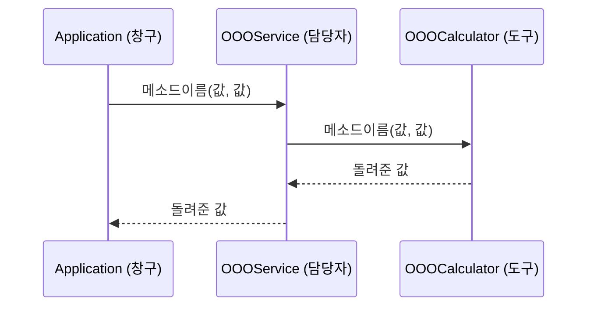

1. 이슈를 만들고 시작 
2. appilcation은 입출력만 
3. 각자 담당자(case) 도구(method) 클래스 만들기 
4.  이슈 제목  [메뉴 2] 학점 계산 형식
이슈 템플릿
## 기능
(미션의 한 줄 목표를 내 말로)

## 담당
@github아이디

## 내가 만들 클래스와 메소드
(미션 3번 표의 메소드 선언부를 글자 그대로 옮겨 적기)
- (OOOCalculator)
  - (메소드 선언부)
  - (메소드 선언부)
- (OOOService)
  - (메소드 선언부)
  - (메소드 선언부)

## 규칙을 내 말로
- (미션 2번 규칙을 읽고, 어떤 입력에서 어떤 결과가 나오는지 내 말로)

## 호출 흐름도
(미션 4번 호출 흐름을 보고 mermaid 로 직접 그리기)

5. 본문 제목 feat: 한글로 짧은 설명(#이슈번호)
closes #(내 Issue 번호)
이름: 축약가능 

## 실행 화면
(내 메뉴를 실행한 캡처. 잘못된 입력을 넣은 화면도 하나)

## 흐름 추적표
입력 : (메뉴 번호와 입력한 값)

| 순서 | 파일 | 메소드 | 받은 값 | 돌려준 값 |
|------|------|--------|---------|-----------|
| 1 | Application | main | (키보드 입력) | - |
| 2 | | | | |
| 3 | | | | |

## 테스트 입력표 확인
- [ ] (입력값) → 기대 출력과
